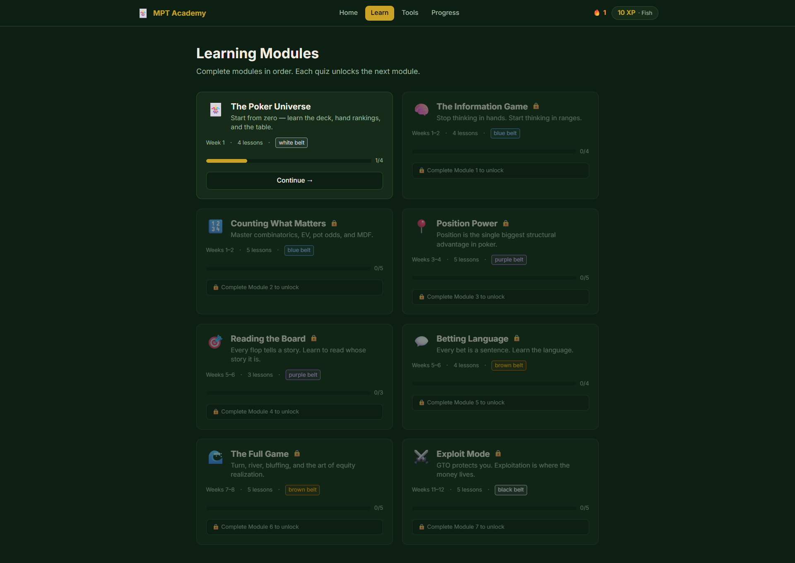
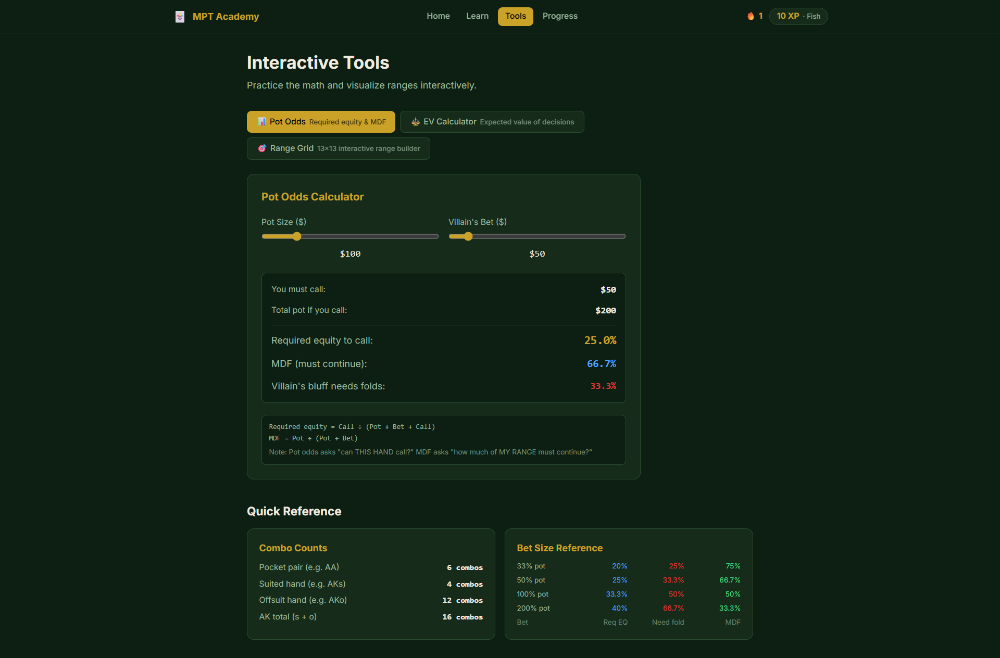
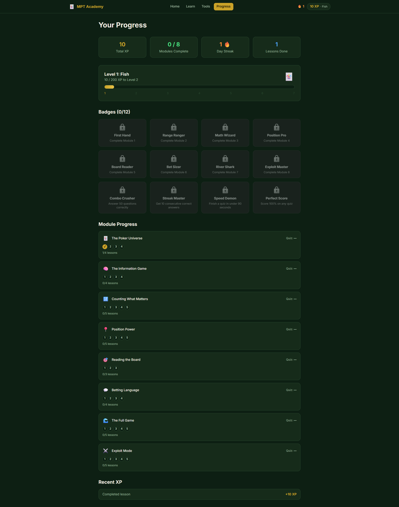

# MPT Academy — Modern Poker Theory Interactive Course

An interactive web application that teaches *Modern Poker Theory* by Michael Acevedo to complete beginners — no prior poker or card-game experience required.


## Inspiration

This project was inspired by the YouTube video **"Why Reading Most Books Is A Waste Of Time"** by Chamath Palihapitiya:

> [https://www.youtube.com/watch?v=N9iLEhievoM](https://www.youtube.com/watch?v=N9iLEhievoM)

In the video, **[Modern Poker Theory: Building an unbeatable strategy based on GTO principles](https://www.simonandschuster.com/books/Modern-Poker-Theory/Michael-Acevedo/9781909457898)** by **Michael Acevedo** is mentioned as one of the few books genuinely worth your time — a rigorous, math-grounded guide to No-Limit Hold'em built around Game Theory Optimal play.

This app takes that book's core ideas and turns them into a gamified, interactive learning experience anyone can start from zero.

## Screenshots







## What You'll Learn

The course follows Acevedo's framework across 9 progressive modules:

| Module | Topic | Belt |
|--------|-------|------|
| 1 | The Poker Universe — deck, hand rankings, table positions | White |
| 2 | The Information Game — range thinking, the 13×13 grid | Blue |
| 3 | Counting What Matters — combinatorics, EV, pot odds, MDF, equity & outs | Blue |
| 4 | Position Power — BTN hierarchy, opening ranges, preflop charts, stack depth | Purple |
| 5 | Reading the Board — static vs dynamic, range vs nut advantage, equity buckets | Purple |
| 6 | Betting Language — bet sizing, c-betting, 7 reasons to bet, 3-bet pot postflop | Brown |
| 7 | The Full Game — turn/river play, bluff selection, multiway pots, hand review | Brown |
| 8 | Exploit Mode — the exploitation matrix, population leaks, bankroll & variance | Black |
| 9 | The Study Table — solver literacy, push/fold, game selection, mental game, study routines | Black |

## Features

- **40+ interactive lessons** with playing card displays, position diagrams, and the 13×13 range grid
- **Worked examples** — step-by-step EV calculations, pot odds decisions, and scenario walkthroughs
- **Preflop range charts** — interactive range grids for UTG, BTN, and BB positions
- **Quiz system** with 80+ questions across three types: multiple choice, board classification, and numeric calculation
- **Interactive tools**: Pot Odds Calculator, EV Calculator, Range Builder
- **Reference Glossary** (`/reference`) — searchable index of 200+ key terms, filterable by module
- **Gamification**: XP, 7 levels (Fish → Poker Theorist), 13 badges, daily streak tracking
- **Progress persistence** via localStorage — picks up where you left off

## Curriculum Depth

The course is structured around Acevedo's three-part framework:

- **Elements of Theory** — EV, equity, Nash equilibrium, GTO vs exploitative play, MDF, combinatorics
- **Preflop Theory & Practice** — opening ranges by position, 3-bet pots, push/fold, stack depth, ICM, bankroll
- **Postflop Theory & Practice** — equity buckets, bet sizing, board textures, c-betting, turn/river play, hand review, solver study

## Running Locally

```bash
npm install
npm run dev
```

Opens at `http://localhost:5173`

```bash
npm run build   # production build → dist/
```

No backend or API keys required. Fully static.

## Built With AI

- **Research & curriculum design** — GPT-5.5 with Extended Thinking synthesized Michael Acevedo's *Modern Poker Theory* into the 33-section treatise that drives all lesson content
- **Implementation** — Claude (Sonnet 4.6) built the full React application from the treatise

## The Core Premise

> *Poker is a repeated decision problem under hidden information. GTO gives you the equilibrium baseline. Exploitative poker makes money when opponents deviate from that baseline.*

The goal is not to memorize charts. The goal is to become a **solver-literate, range-based, exploit-capable** decision maker.
